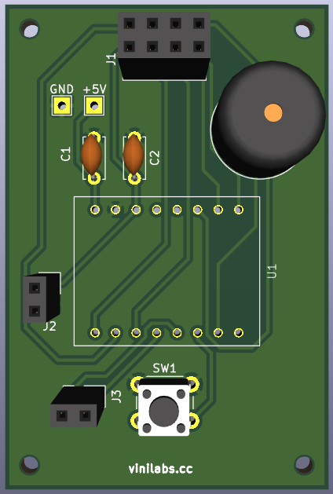
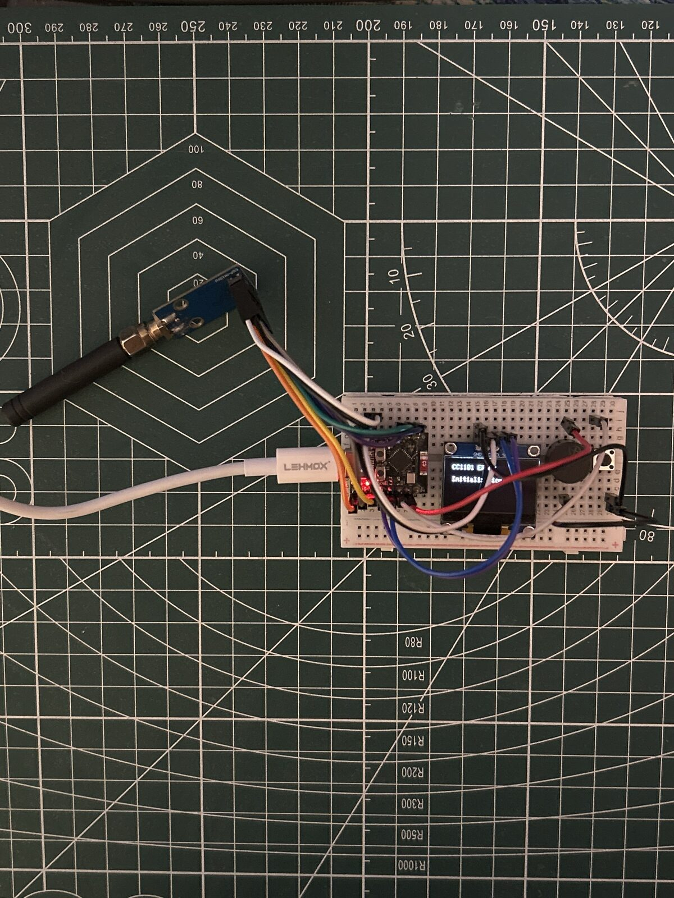
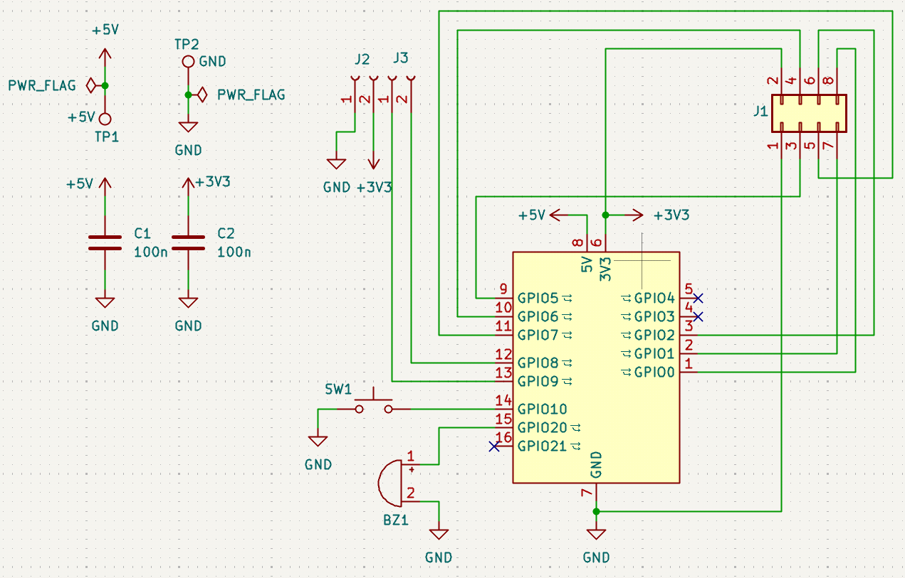
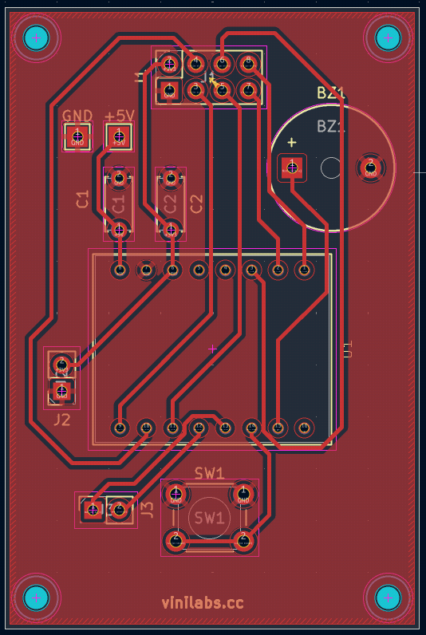

# CC1101 Morse

A handheld Morse transceiver. Key it and the characters go out over 433 MHz;
leave it idle and it decodes what another unit sends back.

Press the key. The device times your dots and dashes, sounds a sidetone so you
hear what you send, keys the CC1101 in step, and prints the decoded letter over
serial. Point a second one at it and the two talk to each other.

The design goal is a board simple enough to make at home: **single layer,
through-hole only, no jumper wires**. There is no display — output is the buzzer
and the serial monitor — and that constraint is what keeps everything else
small.

<p align="center">
  
</p>

## Why it is simple

What the board carries is one module on a socket, a button, a buzzer, two
capacitors, two test points and two breakout headers — plus the MCU. None of it
surface-mount. That routes on a single face with no crossings to resolve.

| | |
|---|---|
| Layers | **1** |
| Vias | **0** |
| SMD parts | **0** |
| Jumper wires | **0** |
| Parts to solder | **10** |
| Display | serial + buzzer |

Zero SMD means the board can be hand-soldered from the underside with a plain
iron, and the fiber laser only ever etches one face — no two-sided
registration.

## Hardware

| Part | Role |
|---|---|
| ESP32-C3 Supermini | the brain — timing, decoding, radio, everything |
| CC1101 module | 433 MHz transceiver, socketed |
| Momentary key | Morse input |
| Passive buzzer | sidetone on transmit, audio on receive |
| SSD1306 OLED | *optional* — decoded text, plugs into `J2`/`J3` |

Everything runs at **3.3 V**. The CC1101 is natively 3.3 V and so is the
ESP32-C3, so the supply is just the Supermini's onboard regulator — no boost
converter, no level shifter, no charge circuit.

### Pin budget — 8 of 13 GPIOs

| Function | Pins |
|---|---|
| CC1101 (SCK, MISO, MOSI, CS, GDO0, GDO2) | 6 |
| Morse key | 1 |
| Buzzer | 1 |
| **Total** | **8 — 5 spare** |
| *OLED (I²C, optional, off-board)* | *2 of the 5* |

See `docs/hardware.md` for the wiring detail.

## Transmit and receive

The CC1101 sends Morse as **OOK** — on-off keying, the carrier simply switched on
for a mark and off for a space. That is what Morse *is* on a radio, and it means
the transmitted signal is the key line itself: no packet format, no framing, no
preamble.

Receiving is the same idea backwards. The CC1101 is put in async serial mode,
where GDO0 goes high whenever the carrier is present, and the firmware times that
pin exactly the way it times the key. One decoder serves both directions.

> [!WARNING]
> **Never key the transmitter with the antenna unscrewed.** With nothing to
> radiate into, power reflects back into the PA and can damage it. For bench
> testing without emitting, use a 50 Ω dummy load in place of the whip.

> [!IMPORTANT]
> The legal position for 433 MHz short-range transmission in Brazil (ANATEL) has
> not been researched. Do that before transmitting outside a dummy load — see
> `docs/roadmap.md` phase 4.

## Power

USB-C, from the ESP32-C3 Supermini's own port. No battery, no charger, no boost,
no battery-sense divider — the board has **zero power components**.

Going portable later means wiring a cell and a TP4056 to the Supermini's
`5V`/`GND` pins. Nothing else changes, because nothing on the board wants more
than 3.3 V — so no boost converter is involved.

## On the bench

<p align="center">
  
</p>

The prototype, before the PCB exists: ESP32-C3 Supermini, the CC1101 with its
whip screwed on, a microswitch standing in for the key, a buzzer, and an
SSD1306 OLED on GPIO8/GPIO9.

**The OLED is optional.** `docs/decisions.md` §1 chose no display, and §7 kept
GPIO8/GPIO9 free so one could be added anyway; the board now brings them out on
`J3`, with power on `J2`. The firmware supports a display without requiring one:
`display.cpp` probes the I²C bus at startup, and if nothing answers, every
display call becomes a no-op. One binary runs with a screen and without.

## The board

<p align="center">
  
</p>

The CC1101 plugs into `J1`; `SW1` is the key and `BZ1` the buzzer. `C1`
decouples the `+5V` input to the Supermini's regulator, `C2` the `+3V3` rail at
the radio itself, and `TP1`/`TP2` are probe points for `+5V` and ground. `J2`
and `J3` break out power and I²C for an optional display.

<p align="center">
  
</p>

Everything is on the front copper — **no vias, no back-side traces**. Ground is
the pour filling the board rather than a routed net, which is what makes single
layer work: the net that touches every part never has to be threaded past the
others. See `docs/decisions.md` §10.

Four M2 mounting holes, one per corner. Board is 40 × 60 mm.

## Repository layout

```text
.
├── bom/          # bill of materials
├── docs/         # design decisions, hardware notes
├── firmware/     # Arduino sketch (firmware/cc1101-morse/)
├── hardware/     # KiCad project, datasheets
├── mechanical/   # Onshape exports, case STEP/STL
└── media/        # reference images, photos
```

## Toolchain

- **KiCad** for the PCB (`hardware/kicad/`), exported to DXF for the laser —
  see `docs/fabrication.md`
- **Onshape** for the case, exported to `mechanical/`
- **Fiber laser** to engrave the copper
- **Arduino** for firmware (`firmware/cc1101-morse/`)

Keep editable sources as the source of truth: `.kicad_pro`, `.kicad_sch`,
`.kicad_pcb`, `.ino`, native CAD.

Generated manufacturing output lives in `exports/` and **is committed** —
`hardware/kicad/cc1101-morse/exports/` holds the DXF and drill files the laser
takes. They are derivatives, but a repo whose point is that you can make the
board should carry what the machine eats, without needing KiCad installed to
get it. Regenerate after any board change: `docs/fabrication.md` has the
commands.

## Status

**PCB done.** Routed by hand on one layer, no vias, ground poured. DRC clean:
0 violations, 0 unconnected, 0 schematic-parity errors. DXF and drill files are
exported for the laser — see `docs/fabrication.md`. Not etched yet.

**The radio works.** On the breadboard the CC1101 answers over SPI
(`PARTNUM 0x0`, `VERSION 0x14`), and `send SOS SOS SOS` at 5 wpm was received on
an RTL-SDR in AM at 433.92 MHz. Key, decoder, buzzer and OLED all confirmed.

Next is phase 2 in `docs/roadmap.md` — a second unit, so two boards talk to each
other.

## Licence

GPL-3.0 — see `LICENSE`.
